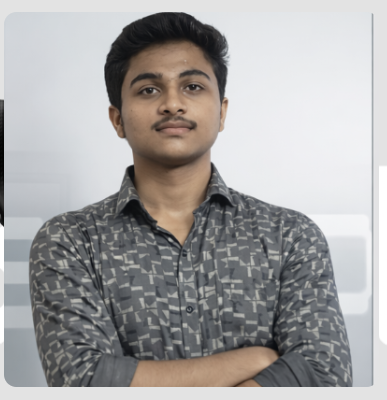

  
  
   
  
  <!-- Social Media Badges -->
  

    
    &nbsp;
    
    &nbsp;
    
  

 

<!-- About Me Section -->
<h2>🚀 About Me</h2>
<table border="0">
  <tr>
    <td width="30%" valign="center">
      
    </td>
    <td width="70%" valign="top">
      <h3>Hi there, I'm Sameer! 👋</h3>
      

        I am a driven developer specializing in <b>Artificial Intelligence, Machine Learning, and Cloud Computing</b>. I love building agentic AI systems and secure financial platforms that solve real-world problems. My passion involves transforming complex data into actionable insights and creating autonomous tools.
      

      <ul>
        <li>🔭 I’m currently working on <b>Agentic Emergency Response Systems</b> & <b>Smart P2P Lending Platforms</b>.</li>
        <li>🌱 I’m currently learning <b>Advanced Multi-Agent Workflows</b> and <b>Cloud-Native Architectures</b>.</li>
        <li>🤝 I’m looking to collaborate on <b>AI-driven Open Source Projects</b>.</li>
        <li>💬 Ask me about <b>Python, Data Science, and Building AI Agents</b>.</li>
      </ul>
    </td>
  </tr>
</table>

 

<!-- Featured Projects Section -->
<h2>🔥 Featured Projects</h2>

<!-- Project 1 -->
<table>
  <tr>
    <td width="100%">
      <h3 align="center">🏆 Smart P2P Micro-Lending System</h3>
      
<i>Winner - "INNOVATE BUILD DISRUPT THE INDUSTRY" Hackathon</i>

      

        A secure, token-based peer-to-peer micro-lending platform built exclusively for students. This system bridges the gap in financial accessibility by allowing students to lend and borrow small amounts instantly within a trusted ecosystem.
      

      <blockquote>
        <b>Key Feature:</b> Virtual token economy ensuring secure and transparent transactions.
      </blockquote>
    </td>
  </tr>
</table>

 

<!-- Project 2 -->
<table>
  <tr>
    <td width="100%">
      <h3 align="center">🤖 CodeForge Commander</h3>
      
<i>Built for i-Hack 2025 GitLab CodeForge Track</i>

      

        An all-in-one <b>DevSecOps AI Agent</b> extension for VS Code. This tool assists developers by automating security checks and streamlining the DevOps pipeline directly within the editor.
      

      <blockquote>
        <b>Key Feature:</b> Real-time AI assistance for GitLab workflows.
      </blockquote>
    </td>
  </tr>
</table>

 

<!-- Project 3 -->
<table>
  <tr>
    <td width="100%">
      <h3 align="center">🚑 AI-Driven Emergency Response System</h3>
      
<i>Project for Zynd Aickathon 2025</i>

      

        A sophisticated multi-agent system designed to optimize emergency response times. It utilizes AI to coordinate resources and manage critical information flow during crisis situations.
      

      <blockquote>
        <b>Tech Stack:</b> Agentic AI, Cloud Integration.
      </blockquote>
    </td>
  </tr>
</table>

 

<!-- Tech Stack Section -->

  <h2>🛠 Tech Stack</h2>
   
  
   
  
<b>Languages:</b> Python, C++, Java

  
<b>Domains:</b> Artificial Intelligence, Machine Learning, Data Science, Cloud Computing

 

<!-- Footer -->

  

